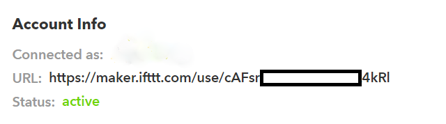
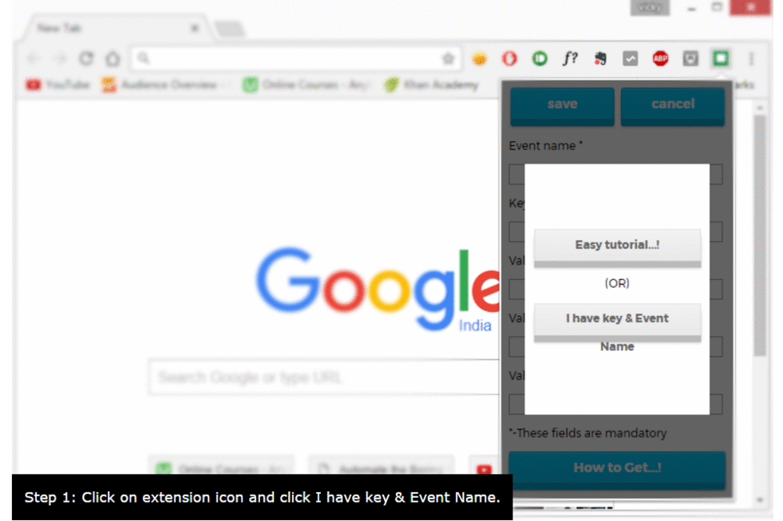

#### IFTTT Chrome Button Intresting Tips
* [makeuseof.com 9-easy-ifttt-button-tricks-quickly-automate-life](http://www.makeuseof.com/tag/9-easy-ifttt-button-tricks-quickly-automate-life/)
* [gizmodo.com 15-clever-recipes-to-try-with-ifttts-new-do-apps-1686946276](http://fieldguide.gizmodo.com/15-clever-recipes-to-try-with-ifttts-new-do-apps-1686946276)

## How to setup IFTTT Chrome Button, a Chrome Extension for IFTTT - unofficial ?

## Install IFTTT Chrome Button
* [Click on **ADD TO CHROME**](https://chrome.google.com/webstore/detail/ifttt-chrome-button-unoff/komgjgehifckemhnghbjkecolfamhhpb)
* Click on **Add extension**

## How to setup IFTTT Webhooks channel ?
1. Login to your [**IFTTT**](https://ifttt.com/discover) account and search for the **Webhooks** channel. You can also get there by visiting [ifttt.com/maker](https://ifttt.com/maker).

2. You can see the description of the Webhooks channel along with a connect button in it. Go head and click on **connect**. You will get a page consisting of some descriptions about triggers and actions

3. Go to **setting** in that page where you can see your account informations

4. From the account info section you can see there are three lines which describes your username, your URL link and your status.The moment when you connect to Webhooks channel it will generate a unique key.You can get the key from the URL link which is at last of the link.

For example,the key from the url https://maker.ifttt.com/use/cAFsrJxxxxxxxxxxxx4kRI is **cAFsrJxxxxxxxxxxxx4kRI**

    Everytime you disconnect and connect your Webhooks your key gets changed

**PLEASE DONT SHARE YOUR KEY**

## Creating Applet
For example, I will create a recipe which sends me mail whenever the event is triggered.
Go to [**IFTTT**](https://ifttt.com/discover) home page and go to myapplet and click on new applet.The screen will present with the following which is basically **if this happens do that**.

### Part - 1 (this part)

1. Click on **this** to get started with applet creation.

2. You will be displayed with lot of channels. Go head and search for **Webhooks** and select it

3. Choose **trigger** page will get displayed along with recieve a web request on the leftside

4. The moment you click on **recieve a web request** it will ask for the **event name**. Give any name and click **create trigger**.

### Part - 2 (that part)

1. Click on **that**.

2. Search for **gmail** in the channel search and select **connect** or you can select **Email** in the screen.

3. You will get a screen with **send a mail** block in it. Click on it

4. In send a mail block alter the body and subject info. **You can also add values to it by clicking on ingredient button**.

5. After editing your send a mail info click on **create action**.

6. The final screen will display the description of the recipe.click on **finish** to create the recipe.**The selection can be changed at anytime by clicking back button on the top left corner of the screen**.

## Extension guide
1. Click on extension icon and select `I have key & event name`

2. Enter your event name and your unique key and click `save`

3. Now if you click on extension icon the event you saved will be displayed like button

4. click on the `button`

***Voila! you will get mail to your registered mail Id.***
### Quick overview of Extension in slides

## Conclusion
And that's it, you are now ready to get going with IFTTT and 

channel. Share your recipes on reddit and the forums.Help us out to improve our chrome extension.
